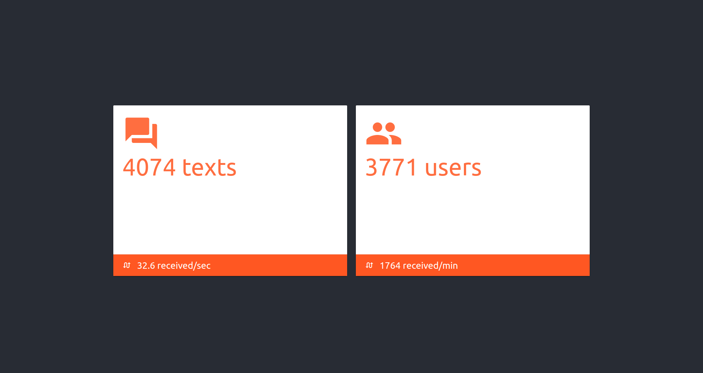

# Indivisa
## Getting started
First of all, you need to have a Docker installation in your computer. Afterwards, you can launch Indivisa executing **launch.sh**. 

## Docs and technology
**Social Big Data** is focused on the content generated by social media. Twitter, for example, generates over 481000 tweets per minute. Processing such amount of information means a computational challenge itself. However, being capable to do it in real time is an added value.
Indivisa's main use case is companies reputation analysis in social media and their products or competitors' ones. It comes from Python library Catenae, developed in CiTIUS (Centro Singular de Investigación de Tecnologías Inteligentes de la USC), which has numerous advantages like its facility to scale or the possibility of doing RPC calls between modules.
Indivisa is composed by some preinstalled modules and it lets user's to upload their own ones developed by themselves. Between preinstalled ones, there are: a real-time text filter, a topic analysis module, a dynamic tag cloud generator and a batch processing module, among others.
Now, we should consider what differentiates Indivisa from other Big Data frameworks like, for example, Hadoop or Storm. 

For more information, have a look at **indivisa.pdf**

## Web Interface
Some interface images are available below.

