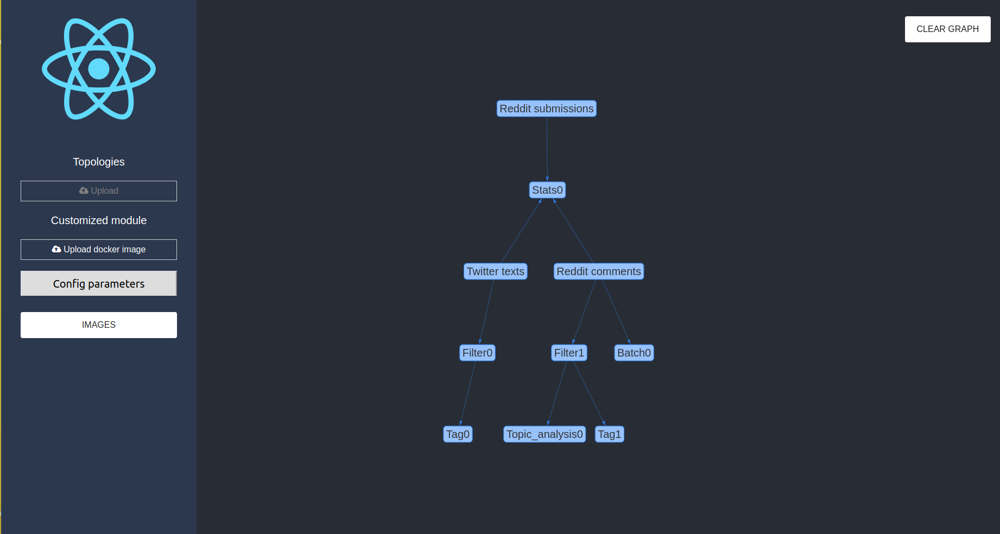
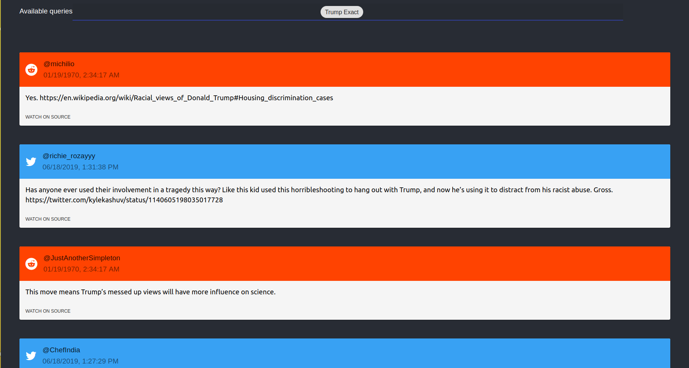
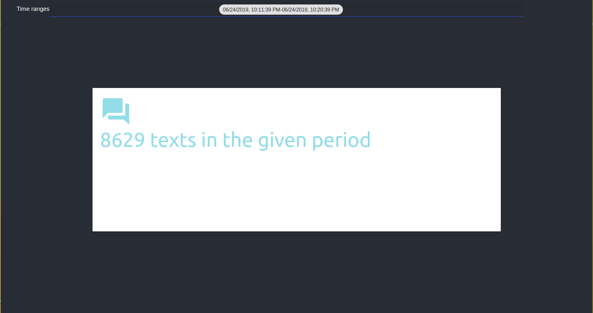

# Indivisa
## Getting started
First of all, you need to have a Docker installation in your computer. Afterwards, you can launch Indivisa executing **launch.sh**. 

## Docs and technology
**Social Big Data** is focused on the content generated by social networks. Twitter, for example, generates over 481000 tweets per minute. Processing such amount of information means a computational challenge itself. However, being capable to do it in real time is an added value.
Indivisa's main use case is companies' reputation analysis in social networks and their products or competitors' ones. It comes from Python library Catenae, developed in CiTIUS (Centro Singular de Investigación de Tecnologías Inteligentes de la USC), which has numerous advantages like its facility to scale or the possibility of doing RPC calls between modules.
Indivisa is composed by some preinstalled modules and it lets user's to upload their own ones developed by themselves. Between preinstalled ones, there are: a real-time text filter, a topic analysis module, a dynamic tag cloud generator and a batch processing module, among others.

Now, we should consider what differentiates Indivisa from other Big Data frameworks like, for example, Hadoop or Storm. 

It combines streaming operations with batch processing, it is written in native Python, it allows cycles in consume topologies and it uses Docker in order to simplify dependency management. However, the main achievement here is its capacity to create consumer topologies in a visual way. 

Indivisa gathers knowledge from different areas like HPC, Big Data or Machine Learning. As it was said before, there could be two kinds of final users: the ones that only want to see dashboards with the results and programmers that might want to upload their own modules and make this platform bigger than now. 

For more information, have a look at **indivisa.pdf**

## Video (Demo)

You can have a look at **video.mp4** in order to have an idea about how to work with Indivisa.

## Web Interface

Some user interface images are shown below.

In the main page, users can configure its own toplogy in a visual way.

Real-time filtering is a way to extract texts that are mentioning a given query in social networks. 

In this case, we decided to make a simple example of batch processing: counting texts in a time range. However, the goal was showing Indivisa's other way of working. 

Tag cloud module is a first approach to automatic summarization and it could be improved into a NLG summarization module.

Topic analysis module helps users to identify hidden topics in a dynamic corpus.

Stats module returns platform statistics since it was put into production.

